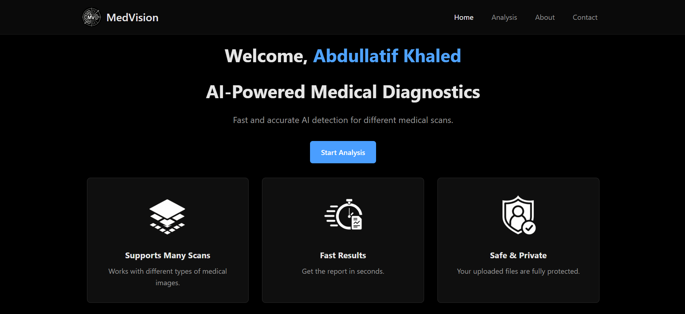
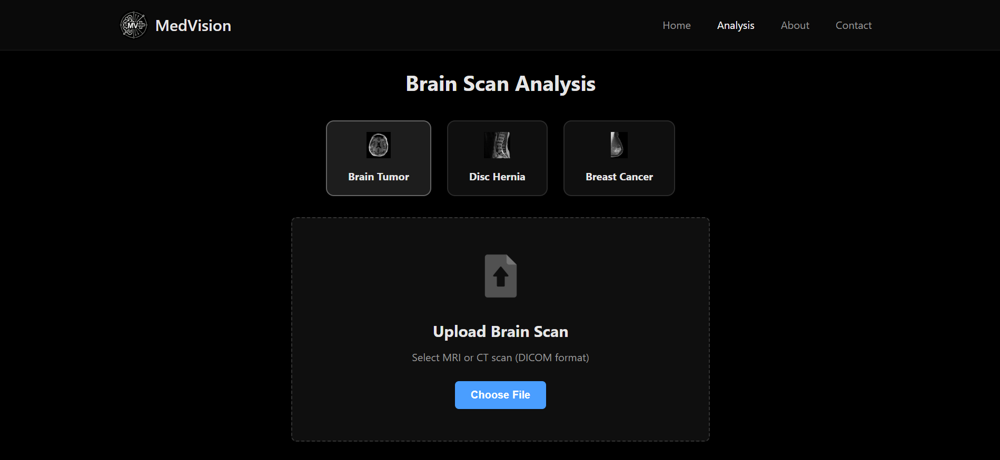
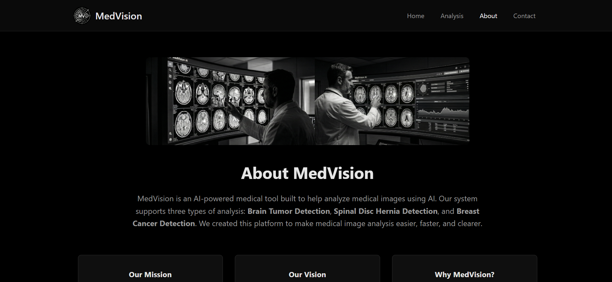
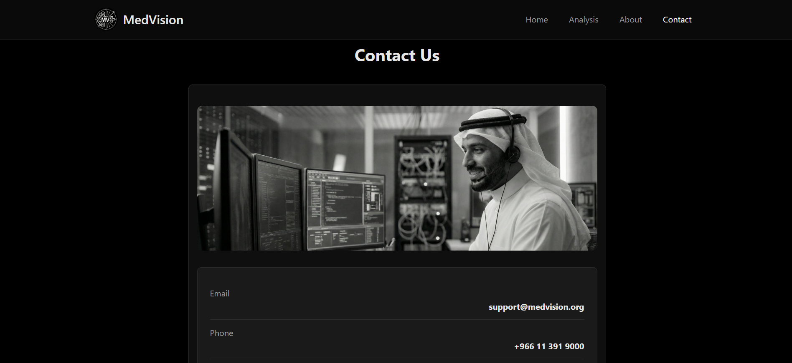

# MedVision
AI-Powered Medical Image Analysis System

## Overview
MedVision is a web-based medical image analysis platform designed to assist in detecting medical conditions using artificial intelligence. The system supports three types of medical scans:
* **Brain Tumor Detection** - MRI scan analysis for brain tumors
* **Disc Hernia Detection** - Spinal MRI analysis for disc herniation
* **Breast Cancer Detection** - Mammogram analysis for breast cancer

This project was developed as part of a study on AI applications in healthcare diagnostics.

## Features
* Clean and intuitive user interface
* Support for multiple medical imaging modalities
* Fast image processing and analysis
* Secure user authentication system
* Detailed analysis results with confidence scores
* Responsive design for all devices

## Screenshots






## Tech Stack
* **Frontend:** HTML5, CSS3, JavaScript
* **Backend:** PHP
* **Database:** MySQL
* **Server:** Apache (XAMPP)

## Prerequisites
Before running this project, ensure you have:
* XAMPP (or any Apache + MySQL + PHP environment)
* PHP 7.4 or higher
* MySQL 5.7 or higher
* Modern web browser

## Installation

### 1. Clone the Repository
```
git clone https://github.com/your-username/medvision.git
cd medvision
```

### 2. Database Setup
Open phpMyAdmin and execute the following SQL:
```
CREATE DATABASE medvision;
USE medvision;

CREATE TABLE users (
    id INT AUTO_INCREMENT PRIMARY KEY,
    username VARCHAR(50) NOT NULL UNIQUE,
    password VARCHAR(255) NOT NULL,
    full_name VARCHAR(100) NOT NULL,
    created_at TIMESTAMP DEFAULT CURRENT_TIMESTAMP
);

-- Insert demo user
INSERT INTO users (username, password, full_name) 
VALUES ('admin', 'admin123', 'Administrator');
```

### 3. Configure Database Connection
Update the database connection settings in `login.php`:
```
$conn = new PDO("mysql:host=localhost;port=3307;dbname=medvision", "root", "");
```
Adjust the port number based on your XAMPP configuration (typically 3306 or 3307).

### 4. Deploy Files
Copy all project files to your XAMPP `htdocs` directory:
```
C:\xampp\htdocs\medvision\
```

### 5. Start the Application
1. Launch XAMPP Control Panel
2. Start Apache and MySQL services
3. Open your browser and navigate to: `http://localhost/medvision/`

## Demo Credentials
```
Username: admin
Password: admin123
```

## Project Structure
```
medvision/
├── index.php          # Home page
├── login.php          # Login page
├── logout.php         # Logout handler
├── analysis.php       # Analysis page
├── about.php          # About page
├── contact.php        # Contact page
├── script.js          # JavaScript functionality
├── style.css          # Stylesheet
├── database.sql       # Database schema
└── images/            # Images and icons
```

## Usage
1. Log in using the demo credentials
2. Navigate to the Analysis page
3. Select the type of scan you want to analyze
4. Upload a medical image
5. View the analysis results

## Important Notes

### ⚠️ Demo Version
This is a **demonstration version** of the MedVision system. The current implementation shows the user interface and workflow but uses simulated results.

### AI Model Status
* AI models for medical image analysis have been developed
* Models could not be integrated into the web demo due to GPU requirements
* The current version displays mock results for demonstration purposes
* Future versions will include actual AI model inference

---

**Developed By Medvison Team | 2025**
